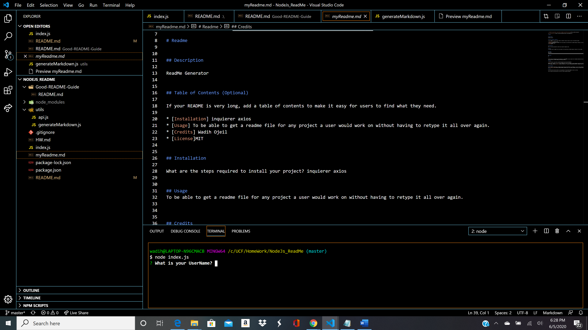

# NodeJs_ReadMe

Project Title
This application I designed fir peronal use to generate as many readme files as I need for my upcoming projects.

Getting Started
You can see the code through the github
page.

Prerequisites
Install
-axios
-inquirer

Deployment
Node.js

Try Me Live
Fork Repo and run node index.js in console.

Built With
Node.js
axios
inquirer.js
JS

Authors
Wadih Ojeil- Full Stack Web Development 

License
This project is licensed under the MIT License

## Purpose and Inspiration
To create convenient readme files to use for future projects.

#### Install and run
Install all the dependencies with NPM
`install`  
Then start the project
` node index.js`

